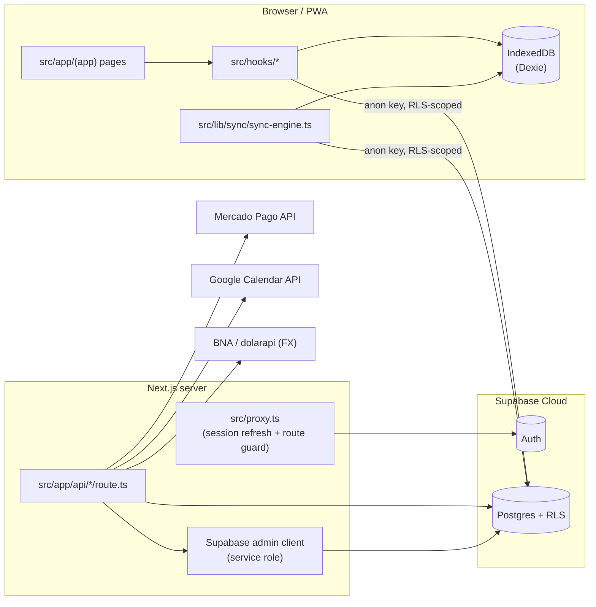
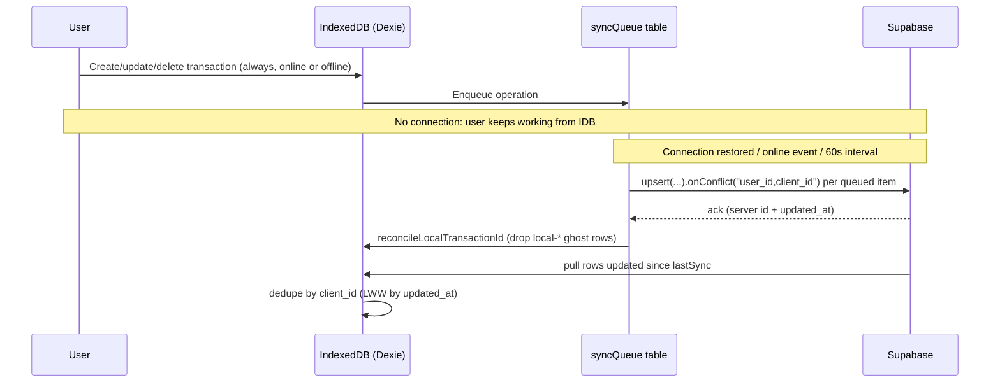

# Architecture

High-level system design for Klaro. For narrower topics see [`docs/`](docs/):
[`docs/database.md`](docs/database.md), [`docs/auth.md`](docs/auth.md), [`docs/api.md`](docs/api.md),
[`docs/deploy.md`](docs/deploy.md). For *why* decisions were made, see [`DECISIONS.md`](DECISIONS.md)
and [`docs/adr/`](docs/adr/).

## Vision

Offline-first personal finance PWA. Every write goes to the browser first (IndexedDB via Dexie);
sync to Supabase happens asynchronously. The UI never blocks on network.

## Stack

| Layer | Technology | Notes |
|---|---|---|
| Framework | Next.js 16 (App Router), React 19, TypeScript 5 (`strict`) | This Next.js major differs from pre-16 conventions — see `AGENTS.md` |
| Styling | Tailwind CSS v4 (CSS-based config, no `tailwind.config.*`), Radix UI primitives, `class-variance-authority` | Tokens in `src/app/globals.css` |
| Charts | Recharts | `src/components/charts/monthly-chart.tsx` |
| Backend | Supabase (Postgres + Auth + Row Level Security) | `supabase/migrations/*.sql` |
| Offline store | Dexie (IndexedDB wrapper) | `src/lib/db/local-db.ts` |
| Validation | Zod | Used in API route handlers |
| Payments | Mercado Pago Checkout Pro | `src/lib/payments/` |
| Calendar | Google Calendar API (OAuth2) | `src/lib/google-calendar/` |
| FX rates | BNA (Banco Nación) scrape + dolarapi.com fallback | `src/lib/finance/bna-rate.ts` |
| PWA | `public/manifest.json`, `public/sw.js` | Installable, offline shell |

No test framework, no CI, no ORM (raw `@supabase/supabase-js` queries), no state-management library
(React hooks + Dexie + Supabase are the only stores).

## High-level diagram



## Architectural principles

1. **Offline-first**: writes land in Dexie immediately; a background sync queue pushes to Supabase.
   The UI always reads from the local store, never blocks on network.
2. **`client_id` idempotency**: every syncable row carries a client-generated UUID (`client_id`).
   Upserts use `ON CONFLICT (user_id, client_id)` so retries and offline replays never duplicate rows.
3. **Last-write-wins**: sync conflicts are resolved by comparing `updated_at`; the newer row wins.
   There is no manual conflict-resolution UI (see [`KNOWN_ISSUES.md`](KNOWN_ISSUES.md)).
4. **RLS everywhere**: every user-owned table enforces `auth.uid() = user_id`. The anon key is safe
   to ship to the browser because Postgres enforces isolation, not application code.
5. **Service role is server-only and narrowly typed**: `src/lib/supabase/admin.ts` exposes a
   hand-written type covering only the tables the backend needs (OAuth tokens, payment attempts).
   It must never be imported into a Client Component.
6. **Money is integer cents**: all amounts are `bigint` cents in Postgres and `number` cents in
   TypeScript. Never store or compute money as floats.
7. **Multi-currency without mixing**: ARS and USD balances/summaries are always computed and
   displayed per-currency (`Record<CurrencyCode, number>`), never added together.

## Folder structure (actual)

```
src/
├── proxy.ts                 # Next.js "middleware" entry point (see docs/auth.md)
├── app/
│   ├── layout.tsx, page.tsx, loading.tsx, error.tsx, not-found.tsx
│   ├── robots.ts, sitemap.ts, icon.tsx, apple-icon.tsx
│   ├── login/, registro/    # Public auth pages
│   ├── (app)/                # Authenticated shell (route group, shared layout + SyncProvider)
│   │   ├── dashboard/
│   │   ├── transacciones/    # Primary income/expense/transfer/recurring UI
│   │   ├── cuentas/, categorias/, presupuesto/, flujo-de-caja/
│   │   ├── transferencias/, inversiones/, integraciones/, pagos/
│   │   └── gastos/, ingresos/, gastos-recurrentes/   # Legacy paths, redirected in next.config.ts
│   └── api/
│       ├── exchange-rate/bna/            # Public FX proxy
│       ├── google-calendar/{auth,callback,create-event,disconnect,status}/
│       └── payments/{checkout,status,mercadopago/webhook,[id]/status}/
├── components/               # ui/, layout/, transactions/, accounts/, budget/, categories/,
│                             # charts/, dashboard/, payments/, google-calendar/, recurring/,
│                             # providers/ (SyncProvider — the only React context), pwa/
├── lib/
│   ├── supabase/             # client.ts (browser), server.ts (SSR cookies), admin.ts (service role),
│   │                         # middleware.ts (session refresh, used by proxy.ts)
│   ├── db/local-db.ts        # Dexie schema + local CRUD + merge/dedupe helpers
│   ├── sync/sync-engine.ts   # push/pull/syncAll/startAutoSync
│   ├── data/                 # Supabase-backed CRUD: accounts, categories, budgets,
│   │                         # recurring-expenses, investment-assets, seed-user
│   ├── finance/              # currency.ts, calculations.ts, cash-flow.ts, transfers.ts,
│   │                         # investments.ts, bna-rate.ts — pure business logic
│   ├── recurrence/           # engine.ts (RRULE subset), generator.ts (occurrence creation)
│   ├── payments/             # payment-service.ts, payment-repository.ts, providers/mercadopago/
│   ├── google-calendar/      # config.ts, tokens.ts, events.ts, rrule.ts, sync.ts
│   └── categories/, format.ts, brand.ts, user-display.ts, utils.ts
├── hooks/                    # use-transactions, use-accounts, use-categories, use-budget,
│                             # use-investments, use-recurring-expenses, use-google-calendar,
│                             # use-online, use-user
├── types/                     # database.ts (core domain types), budget.ts, recurrence.ts
└── constants/                 # routes.ts, accounts.ts, category-icons.ts
supabase/migrations/           # Versioned SQL, applied in filename order
docs/                          # Topic-specific documentation (see docs/ index below)
public/                        # manifest.json, sw.js (PWA)
```

## Where most CRUD actually happens

Most domain data (transactions, accounts, categories, budgets, recurring expenses) is **not**
served through `/api` REST routes. Client components call Supabase directly (anon key, RLS-scoped)
through the hooks in `src/hooks/`, which also write through to Dexie for offline support. The
`src/app/api/*` route handlers exist only for:

- Server-side secrets that must never reach the browser (Google OAuth tokens, Mercado Pago access
  token/webhook secret) — see `src/lib/supabase/admin.ts`.
- Third-party webhooks (Mercado Pago) that Supabase itself cannot receive directly.
- A public FX-rate proxy that scrapes an external, non-CORS source (BNA).

See [`docs/api.md`](docs/api.md) for the full route list and [`docs/database.md`](docs/database.md)
for the tables the client hooks talk to directly.

## Sync flow



Implementation: `src/lib/sync/sync-engine.ts` (`pushPendingChanges`, `pullRemoteChanges`, `syncAll`,
`startAutoSync` — runs on mount, on the `online` event, and every 60s). Started from
`src/components/providers/sync-provider.tsx`, the only global provider in the app.

## Security

- Auth: Supabase Auth (email + password only; no social login for the app itself).
- Route protection: `src/proxy.ts` → `updateSession()` refreshes the session cookie and redirects
  unauthenticated users away from private routes (see [`docs/auth.md`](docs/auth.md)).
- Transport: HTTPS enforced via HSTS header (`next.config.ts`).
- Headers: CSP, `X-Frame-Options: DENY`, `Permissions-Policy`, COOP — see `next.config.ts`.
- Data isolation: Postgres RLS on every user-owned table, keyed on `auth.uid() = user_id`.
- Secrets: Google OAuth tokens and Mercado Pago credentials are only ever touched server-side via
  the service-role admin client; `user_google_integrations` and `payment_webhook_events` have RLS
  enabled with **no** client-facing policy (default-deny) plus an explicit `REVOKE ALL` from
  `anon`/`authenticated`.
- Webhook auth: Mercado Pago webhook requests are verified via HMAC signature
  (`x-signature` header), not a Supabase session.

## Deployment target

Vercel (implied by `VERCEL_ENV` usage in `src/lib/google-calendar/config.ts`; no `vercel.json` is
checked in, so project settings are configured in the Vercel dashboard). See
[`docs/deploy.md`](docs/deploy.md) for the full process and [`docs/environment.md`](docs/environment.md)
for every environment variable.

## Scaling notes

- Current model: one Supabase project, one `user_id` = one implicit workspace. No shared households
  or teams.
- Local storage is per-browser (IndexedDB), so a user switching devices relies entirely on the
  Supabase pull to repopulate — there is no local backup/restore file export yet.
