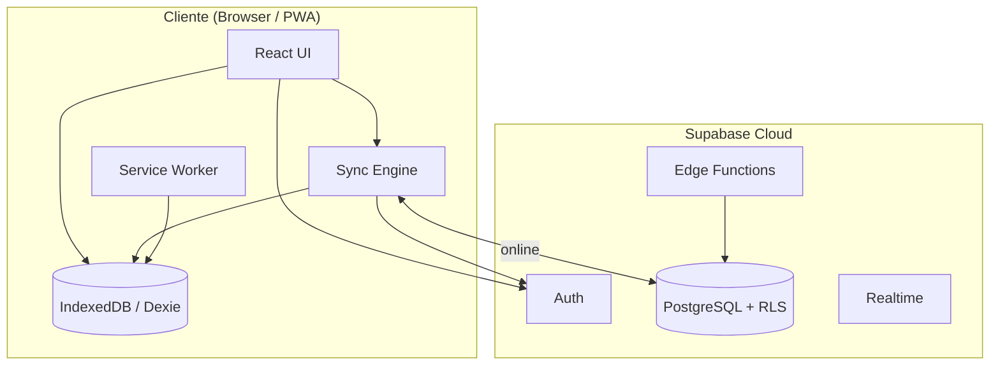
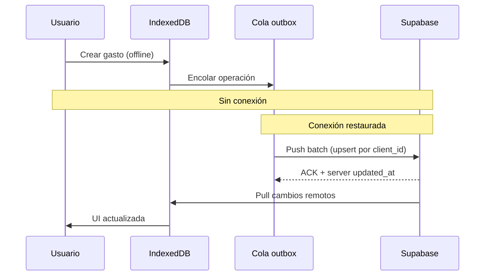

# Arquitectura — Finanzas Personales

## Visión

Aplicación **offline-first** multiplataforma (web, PWA, escritorio, móvil) que centraliza la economía personal con sincronización automática y UX orientada a personas sin formación financiera.

## Stack tecnológico

| Capa | Tecnología | Rol |
|------|------------|-----|
| Frontend | Next.js 15+ (App Router), React, TypeScript | UI, SSR/SSG donde aplica |
| Estilos | Tailwind CSS, shadcn/ui | Diseño consistente y accesible |
| Gráficos | Recharts | Visualizaciones legibles |
| Backend | Supabase (PostgreSQL, Auth, Realtime) | Persistencia, auth, API |
| Offline | Dexie (IndexedDB), Service Worker | Cola local y sync |
| Validación | Zod | Contratos cliente/servidor |
| IA (fase 2+) | Supabase Edge Functions + API LLM | Análisis en lenguaje natural |

## Diagrama de alto nivel



## Principios arquitectónicos

1. **Offline-first**: Toda escritura va primero a IndexedDB; el sync es asíncrono.
2. **Single source of truth local**: La UI lee siempre del store local; el servidor reconcilia.
3. **RLS estricto**: Cada fila pertenece a `user_id`; sin acceso cruzado.
4. **Idempotencia**: Operaciones con `client_id` (UUID) para evitar duplicados en sync.
5. **Conflictos**: Last-write-wins por `updated_at` + registro en `sync_conflicts` para revisión manual.
6. **Simplicidad de dominio**: Módulos desacoplados por agregados (transacciones, presupuesto, patrimonio).

## Estructura de carpetas

```
src/
├── app/                    # Rutas Next.js (App Router)
│   ├── (auth)/             # Login, registro, recuperación
│   ├── (app)/              # App autenticada (layout con nav)
│   │   ├── dashboard/
│   │   ├── ingresos/
│   │   ├── gastos/
│   │   ├── presupuesto/
│   │   ├── fondo-emergencia/
│   │   ├── deudas/
│   │   ├── inversiones/
│   │   ├── patrimonio/
│   │   ├── objetivos/
│   │   ├── analisis/
│   │   └── proyecciones/
│   └── api/                # Route handlers (export, webhooks)
├── components/
│   ├── ui/                 # shadcn
│   ├── dashboard/
│   ├── transactions/
│   └── charts/
├── lib/
│   ├── supabase/           # Cliente browser/server/middleware
│   ├── db/                 # Dexie schema + queries
│   ├── sync/               # Motor de sincronización
│   ├── finance/            # Cálculos (patrimonio, emergencia, etc.)
│   └── ai/                 # Prompts y guardrails del asistente
├── hooks/
├── types/
└── constants/
supabase/
└── migrations/             # SQL versionado
docs/                       # Este directorio
public/
├── manifest.json           # PWA
└── sw.js                   # Service Worker (o Serwist)
```

## Flujo de sincronización



## Seguridad

- Auth: Supabase Auth (email, OAuth futuro).
- Datos en tránsito: HTTPS.
- Datos en reposo: cifrado Supabase; campos sensibles opcionales con cifrado cliente (fase 2).
- RLS en todas las tablas `public`.
- Service role solo en servidor (Edge/API routes).
- IA: disclaimers, sin recomendaciones de inversión específicas.

## Escalabilidad

- MVP: un usuario = un workspace implícito (`user_id`).
- Futuro: `households` compartidos, multi-moneda, integraciones bancarias (Open Banking).

## Despliegue

- **Web/PWA**: Vercel o similar + dominio custom.
- **Supabase**: proyecto dedicado por entorno (dev/staging/prod).
- **Variables** (mismas claves en `.env` y `.env.local`; solo `GOOGLE_REDIRECT_URI` difiere por entorno):
  - `NEXT_PUBLIC_SUPABASE_URL` — URL del proyecto Supabase
  - `NEXT_PUBLIC_SUPABASE_ANON_KEY` — clave anon/publica de Supabase
  - `SUPABASE_SERVICE_ROLE_KEY` — clave service role (solo servidor; tokens OAuth de Google Calendar)
  - `GOOGLE_CLIENT_ID` — OAuth client ID de Google Cloud
  - `GOOGLE_CLIENT_SECRET` — OAuth client secret (solo servidor)
  - `GOOGLE_REDIRECT_URI` — callback OAuth (`http://localhost:3000/...` en local; dominio de producción en `.env`)
