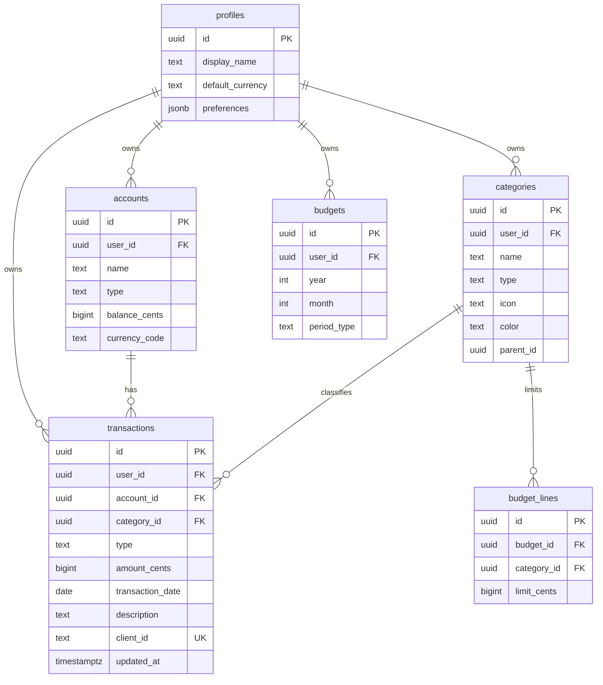

# Diseño de base de datos

## Convenciones

- UUID primarios (`gen_random_uuid()`).
- `user_id` → `auth.users(id)` en todas las tablas de usuario.
- `client_id` UUID único por dispositivo/cliente para sync idempotente.
- `created_at`, `updated_at` (trigger automático).
- Soft delete opcional con `deleted_at` (fase 2).
- Montos en **centavos/unidad mínima** (`bigint`) para evitar errores de float.
- Moneda ISO 4217 (`currency_code`, default `ARS` o configurable).

## Diagrama ER (núcleo MVP + extensión)



## Tablas MVP (implementadas en migración inicial)

### `profiles`
Perfil extendido del usuario autenticado.

| Columna | Tipo | Descripción |
|---------|------|-------------|
| id | uuid PK | = auth.users.id |
| display_name | text | Nombre visible |
| default_currency | text | Moneda principal |
| preferences | jsonb | Tema, locale, alertas |

### `accounts`
Cuentas y billeteras (efectivo, banco, tarjeta).

| Columna | Tipo | Descripción |
|---------|------|-------------|
| type | enum | cash, checking, savings, credit_card, investment, other |
| balance_cents | bigint | Saldo actual (calculado o manual) |

### `categories`
Categorías de ingreso/gasto personalizables.

| Columna | Tipo | Descripción |
|---------|------|-------------|
| type | enum | income, expense |
| parent_id | uuid | Subcategorías |

### `transactions`
Movimientos financieros (ingresos y gastos unificados).

| Columna | Tipo | Descripción |
|---------|------|-------------|
| type | enum | income, expense, transfer |
| amount_cents | bigint | Siempre positivo; el tipo define signo contable |
| tags | text[] | Etiquetas libres |

### `budgets` + `budget_lines`
Presupuesto por período y límites por categoría.

## Tablas fase 2 (diseño preparado)

- **debts** — deudas con cuotas, tasa, vencimiento.
- **debt_payments** — pagos aplicados.
- **investments** — posiciones por instrumento.
- **investment_snapshots** — valor histórico para gráficos.
- **assets** / **liabilities** — patrimonio.
- **financial_goals** — objetivos con target y fecha.
- **emergency_fund_settings** — meta en meses de gasto.
- **sync_conflicts** — conflictos de merge.
- **ai_insights** — resúmenes generados (cache).

## Índices recomendados

```sql
CREATE INDEX idx_transactions_user_date ON transactions(user_id, transaction_date DESC);
CREATE INDEX idx_transactions_client_id ON transactions(user_id, client_id);
CREATE INDEX idx_categories_user_type ON categories(user_id, type);
```

## RLS (resumen)

Todas las políticas siguen el patrón:

```sql
USING (auth.uid() = user_id)
WITH CHECK (auth.uid() = user_id)
```

`profiles`: `id = auth.uid()`.

## Cálculos derivados (aplicación)

| Métrica | Fórmula |
|---------|---------|
| Patrimonio neto | Σ activos − Σ pasivos |
| Ahorro del mes | ingresos − gastos |
| Tasa de ahorro | ahorro / ingresos × 100 |
| Meses de emergencia | saldo fondo / gasto mensual promedio |
| Cumplimiento presupuesto | gasto_real / límite × 100 |

## Conflictos de sync

1. Comparar `updated_at` local vs remoto.
2. Si remoto > local y mismo `client_id` → aplicar remoto.
3. Si divergen sin relación → insertar en `sync_conflicts` y notificar al usuario.
