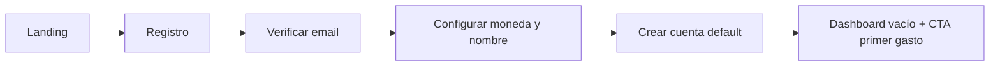
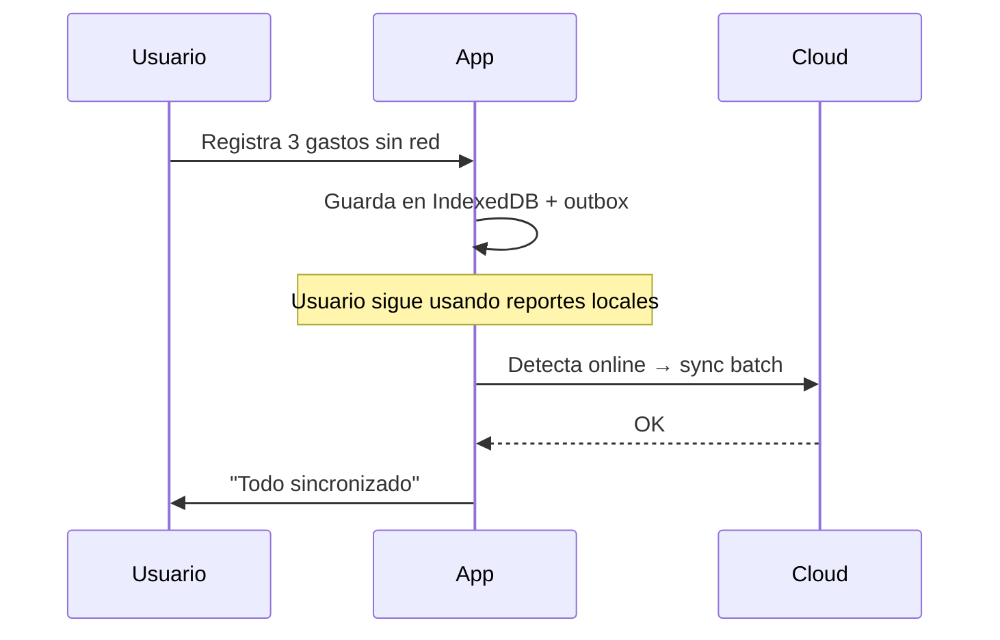

# Flujos de usuario

## Onboarding (primera vez)

## Registrar gasto (happy path)

1. Usuario toca **+ Gasto** (FAB o dashboard).
2. Ingresa monto (teclado numérico en móvil).
3. Elige categoría (sugerida: última usada).
4. Toca **Guardar** → toast "Guardado" → vuelve al dashboard.
5. Offline: mismo flujo; badge "Pendiente de sincronizar" hasta sync.

## Consultar situación financiera (< 30 s)

1. Abre app → Dashboard.
2. Lee patrimonio, ingresos/gastos/ahorro del mes.
3. Ve semáforo de estado y barra de emergencia.
4. Opcional: desliza gráfico de 6 meses.

## Presupuesto y alerta

1. Usuario define límite en categoría "Comida".
2. Al registrar gastos, el % se actualiza.
3. Al 80%: notificación amarilla en dashboard.
4. Al 100%: alerta roja + mensaje simple en insight.

## Sincronización tras offline

## Asistente IA (v1.5+)

1. Usuario pregunta "¿Gasto mucho en salidas?"
2. Sistema agrega datos del mes (sin PII en prompt innecesario).
3. Respuesta educativa + enlace a categoría.
4. Disclaimer visible: no es asesoramiento profesional.
